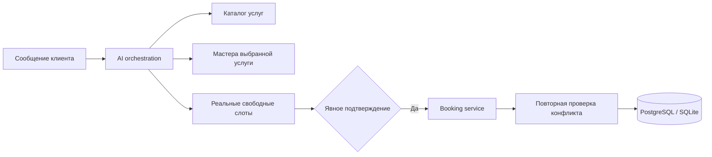
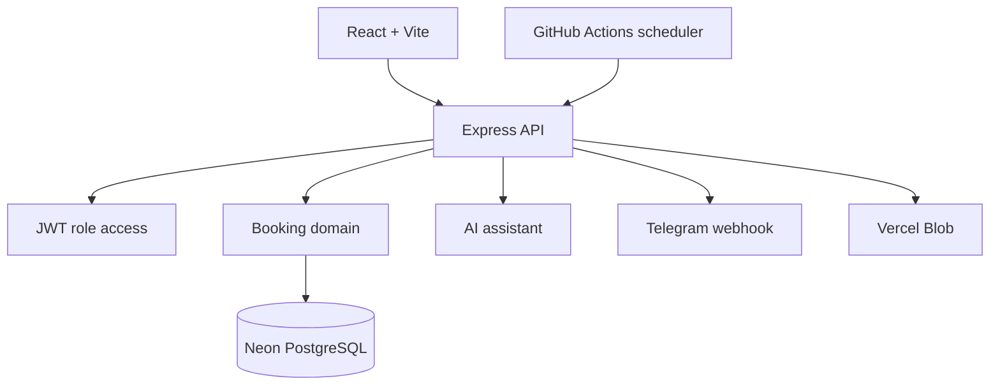

# BarberShop Booking Platform

[](https://github.com/asanchoo/booking-app/actions/workflows/verify.yml)
[](https://booking-app-mocha-three.vercel.app/)
[](https://nodejs.org/)

Коммерческое демо системы онлайн-записи для барбершопов и других сервисных бизнесов. Проект объединяет клиентскую запись, три роли доступа, расписание, Telegram-автоматизацию, отзывы, аналитику и AI-помощника, который работает только с реальными данными приложения.

**[Открыть приложение](https://booking-app-mocha-three.vercel.app/)** · **[Посмотреть case study](docs/PORTFOLIO_CASE_STUDY.md)** · **[Сценарий демонстрации](docs/DEMO_SCRIPT.md)** · **[Release checklist](docs/RELEASE_CHECKLIST.md)**

## Задача продукта

Небольшому бизнесу обычно приходится собирать записи из звонков и мессенджеров, вручную сверять расписание и отдельно напоминать клиентам о визите. Это приложение собирает процесс в одном месте: от выбора услуги до оценки завершённого визита.

## Роли и возможности

| Роль | Возможности |
| --- | --- |
| Клиент | Запись, регистрация, личный кабинет, перенос и отмена визита, Telegram-привязка, оценка услуги |
| Мастер | Собственное расписание, отметка прихода, перерывы, заметки о клиентах, отзывы, загрузка фотографии |
| Администратор | Записи и календарь, клиенты, услуги, команда, роли мастеров, отзывы, аналитика и настройки заведения |

Дополнительно реализованы:

- связь «услуга → подходящие мастера»;
- защита от двойного бронирования и повторная проверка слота при подтверждении;
- адаптивные интерфейсы для телефона и компьютера;
- Telegram-напоминания, подтверждение визита и запрос отзыва после услуги;
- рейтинг клиентов с учётом пропусков и поздних изменений;
- модерация отзывов и CSV-выгрузка;
- PostgreSQL в production и SQLite для локальной разработки;
- хранение фотографий в Vercel Blob;
- автоматические миграции, seed-данные, CI и регрессионные сценарии.

## AI-помощник

Помощник понимает свободные запросы вроде «хочу подстричься завтра вечером», но не получает прямой доступ к базе и не может выдумать мастера или время.



- Gemini используется как основной внешний провайдер, OpenAI поддерживается как резервный.
- Без API-ключей включается детерминированный пошаговый режим.
- Телефон и email удаляются до внешнего AI-запроса.
- Контактные данные вводятся после выбора слота и не сохраняются в истории AI-чата.
- Финальная запись всегда проходит обычные серверные бизнес-правила.
- Evals проверяют groundedness, даты, связи услуга–мастер и защиту от выдуманных слотов.

Подробнее: [архитектура AI](docs/AI_ARCHITECTURE.md) и [eval-проверки](docs/AI_EVALS.md).

## Архитектура



Production размещён на Vercel. Neon хранит реляционные данные, Vercel Blob — фотографии, Telegram работает через webhook, а защищённое задание напоминаний запускается по расписанию.

## Стек

- **Frontend:** React, Vite, responsive CSS, Lucide Icons.
- **Backend:** Node.js 22, Express 5, JWT, bcrypt, Multer.
- **Data:** PostgreSQL/Neon, SQLite для локальной разработки, SQL migrations.
- **Integrations:** Gemini, OpenAI, Telegram Bot API, Vercel Blob.
- **Delivery:** Docker, Vercel, GitHub Actions, Dependabot.

## Безопасность

- `HttpOnly`, `Secure` в production и `SameSite=Lax` cookies;
- отдельная проверка ролей клиента, мастера и администратора;
- строгий CORS без wildcard origins;
- rate limits для входа, регистрации, записи, AI и интеграций;
- ограничение JSON до 100 КБ и изображений до 5 МБ;
- проверка MIME-типа и сигнатуры загружаемого изображения;
- security headers, запрет iframe-встраивания и кеширования API;
- секреты только в server-side environment variables;
- минимальные permissions GitHub Actions и автоматические dependency updates.

Правила ответственного сообщения об уязвимостях: [SECURITY.md](SECURITY.md).

## Локальный запуск

Требуются Node.js 22+ и npm.

```bash
cp server/.env.example server/.env
npm ci --prefix server
npm ci --prefix client
npm run db:setup
npm run dev
```

Во втором терминале:

```bash
npm run dev --prefix client
```

Frontend: `http://127.0.0.1:5176` · API: `http://127.0.0.1:3001`.

Перед запуском замените `JWT_SECRET` и `ADMIN_PASSWORD_HASH` в локальном `server/.env`. Настоящие `.env` запрещено добавлять в Git.

## Docker

```bash
cp server/.env.example server/.env
docker compose up --build
```

Приложение откроется на `http://localhost:3001`. База и локальные изображения сохраняются в Docker volumes. Проверка готовности:

```bash
docker compose ps
```

## Проверка качества

```bash
npm test --prefix server
npm run build --prefix client
npm audit --prefix server --omit=dev
npm audit --prefix client --omit=dev
```

CI дополнительно разворачивает одноразовую PostgreSQL, применяет все миграции и проверяет роли, каталог, запись, конфликты, перенос, отмену, перерывы, отзывы, AI и Telegram-ссылки.

## Переменные окружения

Полный безопасный шаблон находится в [`server/.env.example`](server/.env.example). Ключевые production-переменные:

| Переменная | Назначение |
| --- | --- |
| `DATABASE_URL` | Подключение к PostgreSQL/Neon |
| `JWT_SECRET` | Уникальный секрет не короче 32 символов |
| `ADMIN_USERNAME` / `ADMIN_PASSWORD_HASH` | Доступ администратора |
| `CLIENT_ORIGIN` / `PUBLIC_APP_URL` | Публичный HTTPS-домен |
| `TELEGRAM_BOT_TOKEN` / `TELEGRAM_WEBHOOK_SECRET` | Telegram-интеграция |
| `CRON_SECRET` | Авторизация задания напоминаний |
| `GEMINI_API_KEY` / `OPENAI_API_KEY` | Серверные AI-провайдеры |
| `BLOB_READ_WRITE_TOKEN` | Загрузка фотографий в Vercel Blob |

Ни одна серверная переменная не должна иметь префикс `VITE_`.

## Структура репозитория

```text
client/                 React-приложение
server/src/routes/      HTTP-маршруты
server/src/services/    Бизнес-логика и интеграции
server/src/db/          Миграции и адаптеры баз данных
server/test/            Автоматические тесты
server/scripts/         Интеграционные regression checks
api/                    Vercel Function entrypoint
docs/                   Архитектура, деплой и case study
.github/workflows/       CI и production reminders
```

## Ограничения демо и следующий этап

Текущий rate limiter хранится в памяти процесса и подходит для локальной версии и защиты отдельного serverless instance. Для многорегионального коммерческого запуска его следует перенести в Redis/KV. Также перед подключением реальных салонов понадобятся multi-tenancy, журнал действий, резервное копирование, мониторинг ошибок и политика обработки персональных данных.

Проект демонстрирует не только интерфейс, но и полный жизненный цикл продукта: анализ задачи, моделирование ролей и данных, безопасную AI-интеграцию, production-деплой, адаптивный UX и автоматические проверки.
